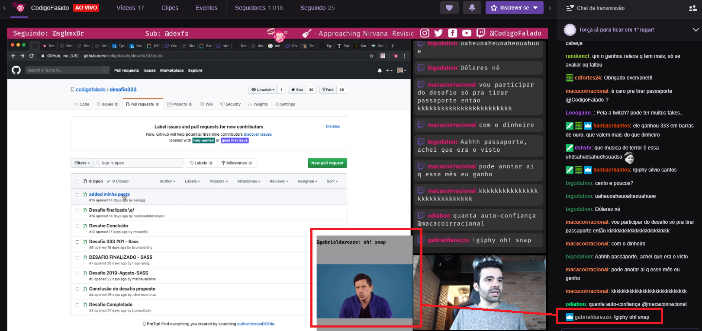

# twitch-giphy


## Objetivo:
Um chatbot para Twitch que integra a API do GIPHY para aprender Typescript

### Exemplo: 
Ao executar o comando:
```
!giphy {NOME_DO_GIF}
```
Ele exibe na sua tela da Twitch.tv:


## Como rodar na sua maquina:
É necessario instalar o [NodeJs / NPM](https://nodejs.org/en/download/) e o [git](https://git-scm.com/downloads).

Após isso abra seu terminal, e execute os comandos abaixo:
```bash 
git clone https://github.com/codigofalado/twitch-giphy.git
cd twitch-giphy
npm install
```
Aguarde a instalação das dependencias, enquanto você aguarda aproveite e siga o canal:
[CodigoFalado](https://www.twitch.tv/codigofalado) no Twitch.


Faça uma copia do arquivo:
`src/config/config.example.ts` com o nome de `src/config/config.ts` 

Obs: é necessario alterar: `SEU_USERNAME`, `SEU_TOKEN`, `SEU_CANAL`, `GIPHY_TOKEN` após gerar o arquivo `config.ts`
```js
const config: Configurations = {
  identity: {
    username: "SEU_USERNAME",
    token: "SEU_TOKEN" // Gera ele aqui, ó: https://twitchapps.com/tmi/
  },
  channels: ["SEU_CANAL"], // Troque pelo seu canal
  giphy: "GIPHY_TOKEN" // Pegue aqui, ó: https://developers.giphy.com/
};
``` 


Agora faça o build da aplicação.
```bash 
npm run build
```

Após isso, você pode subir o servidor node:
```bash 
npm run start
```

Caso tudo ocorra bem no terminal deve aparecer algo como:  
```
√ Joined #SEU_CANAL (257ms) 
```


Para configurar o seu StreamLabs / OBS:
 ???? 

## Must Have

- [x] - Interagir com o chat no Twitch
- [x] - Capturar um comando específico dos usuários (tudo que começar com `!giphy`)
- [x] - Remover o `!giphy` e pegar o termo restante
- [x] - Enviar o termo restante para o GIPHY
- [x] - Retornar o primeiro GIF da API do GIPHY
- [x] - Renderizar o GIF na tela
- [x] - Remover o GIF da tela depois de 8 segundos
- [ ] - Explicar no `README.md` como adicionar seu StreamLabs / OBS.
- [ ] - Criar uma classe em Typescript para lidar com o chatbot/servidor
- [ ] - Alterar a tela do GIF (Browser) para exibir o Username + Balão estilo quadrinhos que cerca todo o GIF.
- [ ] - Refatorar para permitir que todos os streamers DO MUNDO façam uso dessa MARAVILHA da natureza que REVOLUCIONA as Lives :)


## Nice to have

- [ ] - Fazer uma fila de GIFs para garantir que o GIF de todos será exibido
- [ ] - Poder definir quem pode usar o comando (todos, só seguidores, só subs)
- [ ] - Automatizar um deploy para AWS (sempre disponível)
- [ ] - Sisteminha básico de pontos para evitar FLOOD (ou integrar com Cheer)
- [ ] - Implementar cooldown de X segundos para evitar FLOOD.
- [ ] - Possibilitar integração com outras plataformas além do Twitch.
